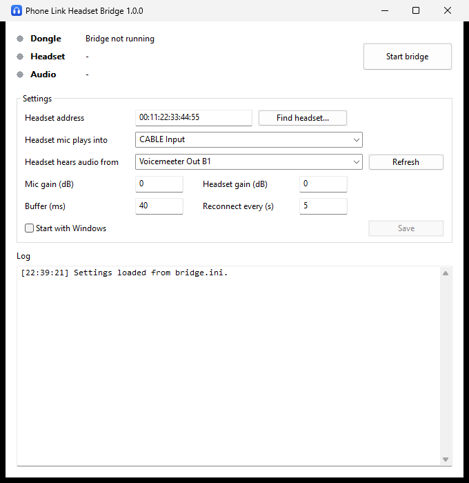

# Phone Link Headset Bridge

Use a Bluetooth headset **with its microphone** for calls in Microsoft Phone Link.

When Phone Link handles your phone's calls, Windows' own Bluetooth radio is busy being a hands-free
device for the phone, and a Bluetooth headset on the same radio typically loses its microphone or
drops to poor audio. This tool sidesteps Windows' Bluetooth completely: it runs the headset on a
**second, cheap USB Bluetooth dongle** with its own Bluetooth stack ([BTstack](https://github.com/bluekitchen/btstack)),
and connects the headset's audio to Windows through virtual audio devices.



```
Phone   ⇄ built-in Bluetooth ⇄ Phone Link ⇄ Windows audio
                                                ⇅
Headset ⇄ USB dongle (WinUSB) ⇄ headset_bridge ⇄ virtual audio cables
```

- Headset microphone → plays into a virtual cable (e.g. VB-Audio Virtual Cable), which Phone Link uses as its microphone.
- Windows audio (e.g. a Voicemeeter bus) → sent to the headset's speakers.
- Uses mSBC wideband speech (16 kHz) when the headset supports it, CVSD (8 kHz) otherwise.
- Reconnects automatically when the headset is switched off and on again.

## What you need

- Windows 10 or 11 (64-bit).
- A **second USB Bluetooth dongle**, used only by this tool. Dongles based on the CSR8510 A10 chip are
  cheap and known to work. Dongles that need firmware loaded by the Windows driver (many Realtek and
  Intel ones) may not work.
- [Zadig](https://zadig.akeo.ie/) to switch that dongle to the WinUSB driver.
- [VB-Audio Virtual Cable](https://vb-audio.com/Cable/) for the microphone path.
- Something to send audio *to* the headset, for example [Voicemeeter](https://vb-audio.com/Voicemeeter/)
  (use one of its output buses) or a second virtual cable.

## Setup

### 1. Give the dongle to WinUSB

1. Plug in the dongle.
2. Run Zadig, enable **Options → List All Devices** and pick the dongle.
   **Make sure it is the dongle and not your built-in Bluetooth adapter** – the device you pick disappears
   from Windows' Bluetooth settings.
3. Select **WinUSB** as the driver and click **Replace Driver**.

To undo this later, open Device Manager, uninstall the device (tick "delete the driver"), and replug it.

### 2. Install the bridge

Download the latest release zip from the Releases page and extract it to a folder you can write to,
such as `Documents\PhoneLinkHeadsetBridge` (not Program Files – settings and pairing keys are stored
next to the program).

### 3. Configure it with the GUI

1. Run `headset_bridge_gui.exe`.
2. Put the headset in pairing mode and click **Find headset...**, then choose it from the list.
3. **Headset mic plays into**: the virtual cable's *playback* side, e.g. `CABLE Input`.
4. **Headset hears audio from**: the recording device carrying the audio you want in the headset,
   e.g. `Voicemeeter Out B1`.
5. Click **Save**, then **Start bridge**. The first connection pairs automatically.

Then in Phone Link (or Windows sound settings) select `CABLE Output (VB-Audio Virtual Cable)` as the
microphone, and send call audio to whatever feeds the "hears audio from" device (for Voicemeeter: output
to a Voicemeeter input with the B1 bus enabled).

Closing the window while the bridge runs keeps it running in the notification area; right-click the tray
icon to stop it or exit. Tick **Start with Windows** to start it in the tray at login. The tray icon turns
green when headset audio is flowing, amber while connecting and red when something needs attention.

## Console version

`headset_bridge.exe` is the bridge itself; the GUI just runs it in the background. You can use it
directly with a `bridge.ini` next to it (copy `bridge.example.ini`):

```
headset_bridge.exe [--list] [--scan] [--log] [--config <path>]
  --list        list audio devices and exit
  --scan        search for nearby Bluetooth devices (to find the headset address) and exit
  --log         write a Bluetooth packet log to hci_dump.pklg (open with Wireshark)
  --config      use a different config file (default: bridge.ini next to the exe)
  --version     print the version and exit
```

`start-bridge.cmd` in the repository runs it from a source checkout.

### Settings (`bridge.ini`)

| Key | Default | Meaning |
|---|---|---|
| `headset_address` | (empty) | Headset Bluetooth address, `AA:BB:CC:DD:EE:FF` |
| `mic_output_device` | `CABLE Input` | Playback device that receives the headset mic |
| `speaker_input_device` | `Voicemeeter Out B1` | Recording device sent to the headset |
| `mic_gain_db` / `speaker_gain_db` | `0` | Volume adjustment in dB |
| `latency_ms` | `40` | Buffer per direction (20–500). Raise it if you hear crackles |
| `reconnect_interval_s` | `5` | Seconds between reconnect attempts |

Device names match by case-insensitive substring, so `CABLE Input` matches
`CABLE Input (VB-Audio Virtual Cable)`. WASAPI is preferred.

## Troubleshooting

- **"Could not open the Bluetooth USB dongle"** – the dongle is unplugged, still has the Windows
  Bluetooth driver (redo step 1), or another program is using it. The GUI retries every 10 seconds.
- **Headset never connects** – make sure it is on and not connected to another device (e.g. your phone).
  For the very first connection, put it in pairing mode.
- **"Headset rejected the stored pairing"** – the headset forgot the dongle. Put it in pairing mode;
  the bridge pairs again automatically.
- **Find headset finds nothing** – the headset must be in pairing mode (discoverable), not just switched on.
- **Crackles or dropouts** – raise the buffer (`latency_ms`) to 60–100 ms.
- **"No playback/recording device matching ..."** – click **Refresh** in the GUI (or run `--list`) and pick
  an existing device.

Files created next to the exe: `bridge.ini` (settings), `btstack_<dongle address>.tlv` (pairing keys)
and, with `--log`, `hci_dump.pklg`.

## Building from source

Install [MSYS2](https://www.msys2.org/), then in the **MSYS2 MINGW64** shell:

```sh
pacman -S --needed git mingw-w64-x86_64-gcc mingw-w64-x86_64-cmake mingw-w64-x86_64-ninja \
                   mingw-w64-x86_64-pkgconf mingw-w64-x86_64-portaudio

git clone --recursive <repository url>
cd phone-link-headset-bridge
cmake -S bridge -B bridge/build -G Ninja
cmake --build bridge/build
```

The executables are written to `bridge/bin/`. They are linked statically and need no extra DLLs.
If you cloned without `--recursive`, run `git submodule update --init` first.

The app icon is generated by `tools/make-icon.ps1`.

## Project layout

| Path | Contents |
|---|---|
| `bridge/main.c` | Bluetooth Hands-Free Audio Gateway, connection handling, codecs |
| `bridge/audio_io.c` | PortAudio streams and drift-compensating FIFOs |
| `bridge/scan.c` | `--scan` device discovery |
| `bridge/config.c` | `bridge.ini` loading and saving |
| `bridge/gui.c` | Windows GUI and tray icon |
| `btstack/` | BTstack (git submodule) |

## Contributing

Issues and pull requests are welcome. Please describe your dongle and headset model when reporting
connection problems, and attach a `--log` packet capture if you can.

## License

The code in this repository is released under the [MIT License](LICENSE).

The executables link **BTstack**, whose license permits **personal, non-commercial use only**, so the
bridge as a whole may not be used or redistributed commercially without a commercial BTstack license from
BlueKitchen. PortAudio is linked statically. See [THIRD_PARTY_NOTICES.md](THIRD_PARTY_NOTICES.md).

This project is not affiliated with or endorsed by Microsoft. "Phone Link" is a trademark of Microsoft.
